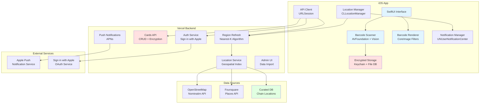
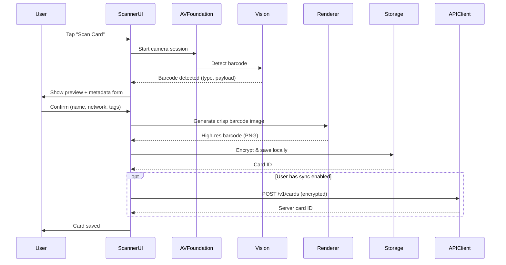
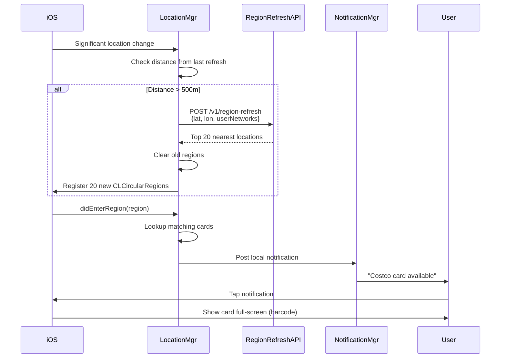
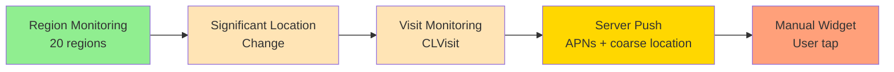
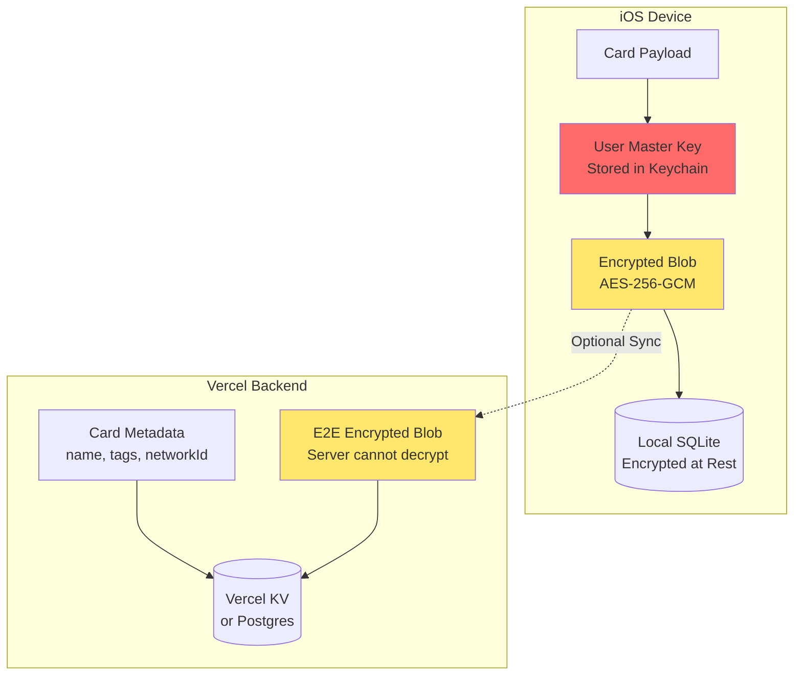

# CardOnCue Architecture

## Table of Contents
1. [System Overview](#system-overview)
2. [Component Architecture](#component-architecture)
3. [Data Flow](#data-flow)
4. [Region Monitoring Strategy](#region-monitoring-strategy)
5. [Security Architecture](#security-architecture)
6. [Component Details](#component-details)
7. [Technical Decisions & Trade-offs](#technical-decisions--trade-offs)

---

## System Overview

CardOnCue is a location-aware digital wallet for membership cards, loyalty cards, and one-time passes. The system automatically surfaces the correct barcode/QR code when a user physically arrives at a location (e.g., Costco, library, Amazon return location).

**Core Principle**: Privacy-first, free-tier optimized, with intelligent workarounds for iOS platform constraints.

### Key Constraints
- **iOS Region Monitoring Limit**: iOS restricts each app to monitoring ~20 geographic regions simultaneously
- **Privacy**: End-to-end encryption for card data; local-first with optional cloud sync
- **Cost**: Designed to run on free tiers (Vercel, OpenStreetMap/Nominatim, Foursquare free tier)
- **Accuracy**: Must render barcodes crisply (not just display photos) for retail scanners

---

## Component Architecture



---

## Data Flow

### 1. Card Scanning and Storage Flow



### 2. Location-Based Card Surfacing Flow



---

## Region Monitoring Strategy

### The iOS 20-Region Constraint

**Problem**: iOS limits each app to monitoring approximately 20 geographic regions simultaneously. For a nationwide chain like Costco (500+ locations) or a library network (100+ branches), we cannot monitor all locations.

**Solution**: Dynamic Region Refresh with Nearest-K Algorithm

### Algorithm: Dynamic Region Refresh

```mermaid
flowchart TD
    Start[User moves] --> CheckDistance{Moved > 500m<br/>OR 6 hours elapsed?}
    CheckDistance -->|No| Wait[Continue monitoring]
    CheckDistance -->|Yes| GetLocation[Get current location]

    GetLocation --> SendRequest[POST /v1/region-refresh<br/>lat, lon, radius=50km]
    SendRequest --> Server[Server calculates<br/>nearest 20 locations]
    Server --> FilterNetworks{Filter by user's<br/>card networks}
    FilterNetworks --> Prioritize[Prioritize by:<br/>1. User has card<br/>2. Distance<br/>3. Visit frequency]

    Prioritize --> Return[Return top 20 locations<br/>with radii]
    Return --> ClearOld[stopMonitoring() all old regions]
    ClearOld --> RegisterNew[startMonitoring() for 20 new regions]
    RegisterNew --> Cache[Update local cache<br/>lastRefresh = now]
    Cache --> Wait

    Wait --> RegionEnter{didEnterRegion?}
    RegionEnter -->|Yes| ShowCard[Post notification<br/>Surface card]
    RegionEnter -->|No| Wait
```

### Region Refresh Triggers

1. **Significant Location Change**: iOS wakes app when user moves significantly (~500m+)
2. **Distance Threshold**: When user moves > max(largest_region_radius, 500m) from last refresh point
3. **Time Threshold**: Every 6 hours if user is moving
4. **Manual Refresh**: User can manually refresh in settings
5. **Visit Monitoring**: Use CLVisit for when user stays at a location (fallback)

### Optimization Strategies

#### 1. Tiered Radii
- **Dense Urban**: 30-100m radius (precise detection)
- **Suburban**: 100-300m radius
- **Large Venues** (theme parks, airports): 500-2000m radius
- **Rural**: 300-500m radius

#### 2. Network-Aware Prioritization
Server prioritizes locations based on:
- User has a card for this network (higher priority)
- Distance from current location
- Historical visit frequency (if tracked)
- Time of day (e.g., prioritize grocery stores in evening)

#### 3. Large Area Handling (Theme Parks)
For venues like Disneyland:
- Mark network as `is_large_area: true`
- Server returns single large geofence covering entire park
- Use multiple overlapping regions if park is very large
- Consider server-driven push as fallback

#### 4. Fallback Mechanisms



### Region Refresh API Contract

**Request**:
```json
POST /v1/region-refresh
{
  "lat": 37.7749,
  "lon": -122.4194,
  "accuracy": 65.0,
  "radius_km": 50,
  "user_networks": ["costco", "whole-foods", "sfpl"],
  "max_regions": 20
}
```

**Response**:
```json
{
  "regions": [
    {
      "id": "loc_costco_sf_001",
      "network_id": "costco",
      "lat": 37.7849,
      "lon": -122.4094,
      "radius_meters": 100,
      "priority": 1,
      "name": "Costco Wholesale - San Francisco",
      "address": "450 10th St, San Francisco, CA"
    },
    // ... 19 more
  ],
  "refresh_after_meters": 500,
  "cache_ttl_seconds": 21600,
  "server_time": "2025-11-22T10:30:00Z"
}
```

### Pseudo-Implementation (iOS)

```swift
class LocationService {
    private let regionLimit = 20
    private var lastRefreshLocation: CLLocation?
    private let refreshThresholdMeters = 500.0
    private let refreshIntervalSeconds: TimeInterval = 21600 // 6 hours
    private var lastRefreshTime: Date?

    func handleSignificantLocationChange(_ location: CLLocation) {
        guard shouldRefreshRegions(for: location) else { return }

        Task {
            await refreshMonitoredRegions(near: location)
        }
    }

    private func shouldRefreshRegions(for location: CLLocation) -> Bool {
        // Check distance threshold
        if let last = lastRefreshLocation {
            let distance = location.distance(from: last)
            if distance < refreshThresholdMeters {
                return false
            }
        }

        // Check time threshold
        if let lastTime = lastRefreshTime {
            if Date().timeIntervalSince(lastTime) < refreshIntervalSeconds {
                return false
            }
        }

        return true
    }

    private func refreshMonitoredRegions(near location: CLLocation) async {
        // 1. Call backend API
        let userNetworks = await storageService.getUserNetworkIds()
        let request = RegionRefreshRequest(
            lat: location.coordinate.latitude,
            lon: location.coordinate.longitude,
            accuracy: location.horizontalAccuracy,
            radiusKm: 50,
            userNetworks: userNetworks,
            maxRegions: regionLimit
        )

        guard let response = try? await apiClient.refreshRegions(request) else {
            return
        }

        // 2. Stop monitoring old regions
        for region in locationManager.monitoredRegions {
            locationManager.stopMonitoring(for: region)
        }

        // 3. Start monitoring new regions
        for regionData in response.regions {
            let region = CLCircularRegion(
                center: CLLocationCoordinate2D(
                    latitude: regionData.lat,
                    longitude: regionData.lon
                ),
                radius: regionData.radiusMeters,
                identifier: regionData.id
            )
            region.notifyOnEntry = true
            region.notifyOnExit = false

            locationManager.startMonitoring(for: region)
        }

        // 4. Update cache
        lastRefreshLocation = location
        lastRefreshTime = Date()

        // 5. Persist to local storage
        await storageService.saveRegionCache(response)
    }
}
```

---

## Security Architecture

### Encryption Model



### Security Layers

#### 1. At-Rest Encryption
- **iOS Keychain**: Store user master key (derived from device key or user passphrase)
- **Card Payloads**: AES-256-GCM encryption with authenticated encryption
- **SQLite Database**: Use SQLCipher or iOS Data Protection API

#### 2. In-Transit Encryption
- All API calls over HTTPS/TLS 1.3
- Certificate pinning for critical endpoints (optional)

#### 3. End-to-End Encryption (Optional Sync)
- **Local-Only Mode** (default): No data sent to server
- **E2E Sync Mode**: Encrypted blob sent to server; server stores opaque ciphertext
- Server only has access to:
  - User ID
  - Card metadata (name, tags, network associations)
  - Encrypted payload (cannot decrypt)

#### 4. Authentication
- **Sign in with Apple**: Primary (JWT validation)
- **Email + Password**: Optional (bcrypt hashed, rate-limited)
- **Session Tokens**: Short-lived JWT (15 min access token, 7 day refresh token)

### Data Storage Matrix

| Data Type | iOS Storage | Server Storage | Encryption |
|-----------|-------------|----------------|------------|
| Master Key | Keychain | Never stored | N/A |
| Card Payload | SQLite | E2E encrypted blob | AES-256-GCM |
| Card Metadata | SQLite | Postgres | At-rest (DB level) |
| Barcode Image | File system (cached) | Never stored | iOS Data Protection |
| Location History | Never stored | Never stored | N/A |
| Current Location | Memory only | Coarse (for region refresh) | HTTPS |

### Privacy Guarantees

1. **Location Privacy**:
   - Never store persistent location history
   - Region refresh uses coarse location (~100m accuracy)
   - No continuous background tracking

2. **Card Privacy**:
   - Payloads never leave device unless user enables sync
   - Server cannot read barcode numbers (E2E encrypted)
   - Original images never uploaded

3. **GDPR/CCPA Compliance**:
   - Export all user data (JSON)
   - Delete account and all server data
   - Clear privacy policy and consent flows

---

## Component Details

### iOS App Components

#### 1. BarcodeService
**Responsibilities**:
- Scan barcodes using AVFoundation + Vision framework
- Decode multiple formats: QR, Code128, PDF417, Aztec, EAN-13, UPC-A
- Render crisp barcodes using CoreImage filters (`CIQRCodeGenerator`, `CICode128BarcodeGenerator`)
- Fallback to third-party renderer if CoreImage doesn't support format

**Key APIs**:
```swift
protocol BarcodeService {
    func startScanning(completion: @escaping (ScannedBarcode) -> Void)
    func stopScanning()
    func renderBarcode(payload: String, type: BarcodeType) -> UIImage?
}

struct ScannedBarcode {
    let type: BarcodeType
    let payload: String
    let rawImage: UIImage?
}

enum BarcodeType {
    case qr
    case code128
    case pdf417
    case aztec
    case ean13
    case upcA
}
```

#### 2. LocationService
**Responsibilities**:
- Manage CLLocationManager and region monitoring
- Implement dynamic region refresh algorithm
- Handle significant location changes and visits
- Post local notifications on region entry

**Key Features**:
- Monitor up to 20 regions
- Refresh when user moves > 500m
- Fallback to significant location change
- Support visit monitoring for static locations

#### 3. StorageService
**Responsibilities**:
- Encrypt and decrypt card data
- Manage Keychain access for master key
- CRUD operations for local card database
- Cache region assignments

**Encryption Strategy**:
```swift
// Pseudocode
func encryptCard(_ card: Card) -> EncryptedCard {
    let masterKey = keychain.getMasterKey() // 256-bit key
    let nonce = generateRandomNonce() // 96-bit
    let payload = JSONEncoder().encode(card)
    let ciphertext = AES_GCM.encrypt(payload, key: masterKey, nonce: nonce)
    let tag = ciphertext.authenticationTag

    return EncryptedCard(
        id: card.id,
        ciphertext: ciphertext.data,
        nonce: nonce,
        tag: tag
    )
}
```

#### 4. NotificationManager
**Responsibilities**:
- Schedule local notifications on region entry
- Provide notification actions (View Card, Dismiss)
- Deep-link to specific card view
- Manage notification permissions

### Backend Components

#### 1. Auth Service
**Responsibilities**:
- Validate Sign in with Apple tokens
- Issue JWT access/refresh tokens
- Rate-limit login attempts
- Manage user sessions

**Flow**:
```
Client → POST /v1/auth/apple {identityToken}
Server → Validate with Apple servers
Server → Create/lookup user
Server → Issue JWT {accessToken, refreshToken}
Client → Store tokens securely
```

#### 2. Cards API
**Responsibilities**:
- CRUD for card metadata
- Store E2E encrypted blobs (opaque to server)
- Associate cards with networks
- Soft-delete and archival

**Endpoints**:
- `GET /v1/cards` - List user's cards
- `POST /v1/cards` - Create card
- `GET /v1/cards/:id` - Get card
- `PATCH /v1/cards/:id` - Update metadata
- `DELETE /v1/cards/:id` - Soft delete

#### 3. Location Service
**Responsibilities**:
- Geospatial indexing of curated locations
- Query nearest locations by coordinate
- Integrate with OpenStreetMap/Foursquare APIs
- Cache results aggressively

**Indexing Strategy**:
- Use geohash for fast spatial queries
- Store in Vercel KV or Postgres with PostGIS extension
- Precompute geohashes for all curated locations

#### 4. Region Refresh Service
**Responsibilities**:
- Implement nearest-K algorithm
- Prioritize by user networks and distance
- Return exactly 20 regions (or fewer if sparse area)
- Suggest appropriate radii based on density

**Algorithm**:
```python
# Pseudocode
def get_top_regions(lat, lon, user_networks, max_regions=20):
    # 1. Get candidates within radius (e.g., 50km)
    candidates = get_locations_within_radius(lat, lon, 50_000)

    # 2. Filter by user networks (prioritize)
    priority = [loc for loc in candidates if loc.network in user_networks]
    other = [loc for loc in candidates if loc.network not in user_networks]

    # 3. Sort by distance
    priority.sort(key=lambda loc: distance(lat, lon, loc.lat, loc.lon))
    other.sort(key=lambda loc: distance(lat, lon, loc.lat, loc.lon))

    # 4. Take top 20
    selected = (priority + other)[:max_regions]

    # 5. Assign appropriate radii
    for loc in selected:
        if loc.is_large_area:
            loc.radius = 1000  # 1km for theme parks
        elif is_dense_urban(lat, lon):
            loc.radius = 50
        else:
            loc.radius = 100

    return selected
```

#### 5. Admin UI
**Responsibilities**:
- Upload CSV files with chain location data
- Trigger import jobs
- View import logs and statistics
- Manage network definitions

**Data Import Flow**:
```
Admin → Upload CSV (Costco locations)
Server → Parse CSV
Server → Geocode addresses if needed
Server → Store in Location table
Server → Build geohash index
Server → Return import summary
```

---

## Technical Decisions & Trade-offs

### 1. Region Monitoring vs. Continuous Tracking

**Decision**: Use region monitoring with dynamic refresh instead of continuous background location tracking.

**Trade-offs**:
- ✅ Better battery life
- ✅ Better privacy (no persistent location history)
- ✅ Meets App Store guidelines more easily
- ❌ Requires server round-trip to refresh regions
- ❌ May miss very rare locations (mitigated by manual widget)

### 2. Local-First Architecture

**Decision**: Default to local-only storage; make cloud sync opt-in.

**Trade-offs**:
- ✅ Maximum privacy
- ✅ Works offline
- ✅ No server costs for free users
- ❌ No cross-device sync by default
- ❌ Data lost if device is lost (mitigated by iCloud backup of encrypted DB)

### 3. Free-Tier Location APIs

**Decision**: Use OpenStreetMap/Nominatim + Foursquare free tier; curate chain data manually.

**Trade-offs**:
- ✅ No recurring API costs
- ✅ Sustainable for free tier
- ✅ Privacy (no third-party tracking)
- ❌ Lower accuracy than Google Places
- ❌ Requires manual curation effort
- ❌ Rate limits on public Nominatim (mitigated by self-hosting or aggressive caching)

### 4. Barcode Rendering vs. Photo Storage

**Decision**: Always render barcodes from decoded payload instead of showing captured photos.

**Trade-offs**:
- ✅ Scanners work reliably (crisp, high contrast)
- ✅ Smaller storage footprint
- ✅ Works in dark mode (invert colors)
- ❌ Requires robust decoding (Vision framework + fallback)
- ❌ Some exotic barcode formats may not render (fallback to photo)

### 5. Serverless Architecture (Vercel)

**Decision**: Use Vercel Edge/Serverless Functions instead of traditional server.

**Trade-offs**:
- ✅ Auto-scaling
- ✅ Generous free tier
- ✅ Global CDN
- ✅ Zero DevOps
- ❌ Cold start latency for serverless functions (~100-500ms)
- ❌ Limited execution time (10-30s)
- ❌ Stateless (requires external DB for persistence)

### 6. Single Xcode Project vs. Multi-Module

**Decision**: Use single Xcode project with clear folder structure instead of SPM packages.

**Trade-offs**:
- ✅ Simpler for initial development
- ✅ Faster compile times (no package resolution)
- ✅ Easier for new contributors
- ❌ Less modular (can refactor later)
- ❌ Harder to enforce boundaries

---

## Assumptions and Citations

### iOS Region Monitoring Limit
- **Assumption**: ~20 regions per app (conservative estimate)
- **Citation**: Apple Developer Documentation states "Registering a large number of regions can consume significant system resources. To ensure the best user experience, Core Location limits the number of regions that can be simultaneously monitored." Best practices suggest 20 as a safe limit.
- **Source**: [Apple CLLocationManager Documentation](https://developer.apple.com/documentation/corelocation/monitoring_the_user_s_proximity_to_geographic_regions)

### Battery and Privacy Considerations
- **Assumption**: Always-on GPS tracking is unacceptable for battery and privacy
- **Mitigation**: Use region monitoring (hardware-assisted) and significant location change (low-power)

### API Rate Limits
- **OpenStreetMap Nominatim**: 1 request/second on public instance (aggressive caching required)
- **Foursquare Free Tier**: 50,000 API calls/month (as of 2024, verify current limits)

### Legal Considerations
- Scraping store locator websites may violate Terms of Service
- Prefer official APIs, open data, or user-submitted data
- Include attribution for OpenStreetMap data (ODbL license)

---

## Next Steps

1. **API Specification**: Define OpenAPI v3 spec for all endpoints
2. **Data Model**: SQL schema for networks, locations, users, cards
3. **iOS Prototype**: Implement scanner + renderer + location service
4. **Backend Scaffold**: Vercel serverless functions with in-memory DB for dev
5. **Seed Data**: Create CSV importers and sample datasets
6. **Testing**: Unit tests for region refresh logic and E2E flow tests
