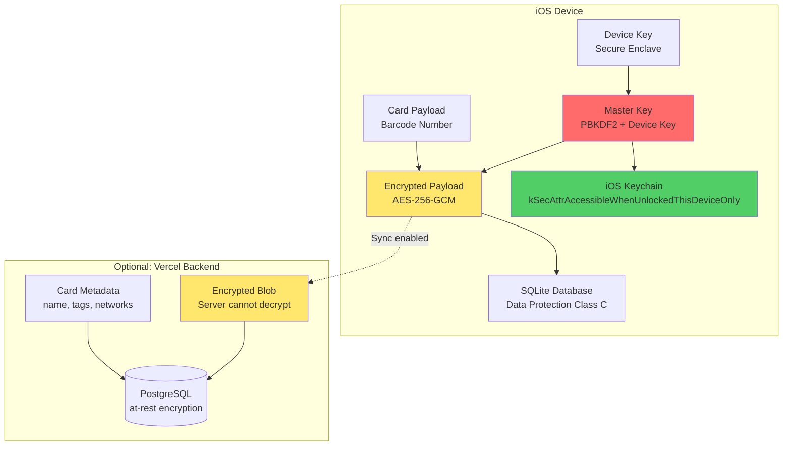
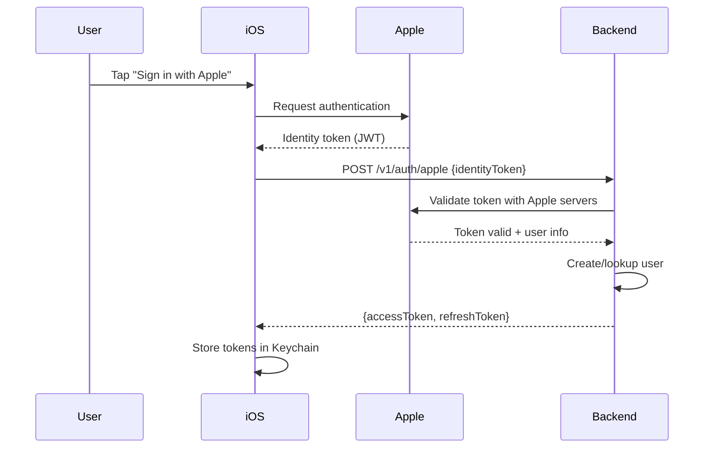
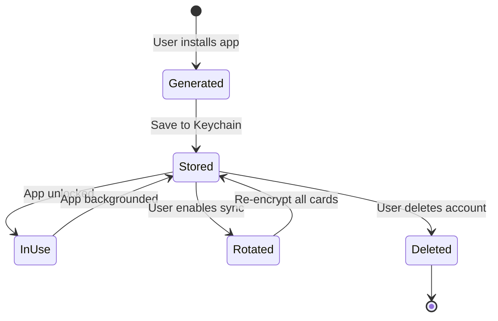

# CardOnCue Privacy & Security Plan

## Table of Contents
1. [Security Principles](#security-principles)
2. [Encryption Architecture](#encryption-architecture)
3. [Data Storage Strategy](#data-storage-strategy)
4. [Authentication & Authorization](#authentication--authorization)
5. [Privacy Guarantees](#privacy-guarantees)
6. [Threat Model](#threat-model)
7. [Key Management](#key-management)
8. [Compliance](#compliance)
9. [Incident Response](#incident-response)

---

## Security Principles

### 1. Privacy-First Design
- **Local-first**: All card data stored locally by default
- **Optional sync**: Users explicitly opt-in to cloud backup
- **End-to-end encryption**: Server cannot decrypt card payloads
- **Minimal data collection**: No analytics, no tracking, no location history

### 2. Defense in Depth
- **At-rest encryption**: AES-256-GCM for all card data
- **In-transit encryption**: TLS 1.3 for all API calls
- **Authentication**: JWT with short expiry + refresh tokens
- **Authorization**: Row-level security on backend

### 3. Zero-Knowledge Architecture (Optional Sync Mode)
When sync is enabled:
- Server stores encrypted blobs it cannot decrypt
- Only metadata (card name, tags, networks) visible to server
- User holds the only decryption key (derived from device or passphrase)

---

## Encryption Architecture

### Overview



### Encryption Specifications

#### 1. Master Key Derivation

**Option A: Device-Bound Key (Default)**
```
Master Key = Device Key (from Secure Enclave)
```
- Pros: Automatic, no user input required
- Cons: Cannot sync to new device without re-scanning cards

**Option B: Passphrase-Derived Key (For Sync)**
```
Master Key = PBKDF2-HMAC-SHA256(
    passphrase,
    salt = User ID,
    iterations = 600,000,
    output_length = 32 bytes
)
```
- Pros: Can sync across devices with same passphrase
- Cons: Requires user to remember passphrase

**Implementation Recommendation**: Start with Option A (device-bound), offer Option B when user enables sync.

#### 2. Payload Encryption

**Algorithm**: AES-256-GCM (Galois/Counter Mode)

**Why GCM?**
- Authenticated encryption (prevents tampering)
- NIST-approved standard
- Hardware acceleration on iOS (AES-NI)

**Encryption Process**:
```swift
func encryptPayload(payload: Data, masterKey: SymmetricKey) throws -> EncryptedPayload {
    // 1. Generate random nonce (96 bits = 12 bytes)
    let nonce = AES.GCM.Nonce()

    // 2. Encrypt with AES-256-GCM
    let sealedBox = try AES.GCM.seal(
        payload,
        using: masterKey,
        nonce: nonce
    )

    // 3. Return ciphertext + nonce + authentication tag
    return EncryptedPayload(
        ciphertext: sealedBox.ciphertext,
        nonce: nonce,
        tag: sealedBox.tag
    )
}
```

**Decryption Process**:
```swift
func decryptPayload(encrypted: EncryptedPayload, masterKey: SymmetricKey) throws -> Data {
    // 1. Reconstruct sealed box
    let sealedBox = try AES.GCM.SealedBox(
        nonce: encrypted.nonce,
        ciphertext: encrypted.ciphertext,
        tag: encrypted.tag
    )

    // 2. Decrypt and verify authentication tag
    let payload = try AES.GCM.open(sealedBox, using: masterKey)

    return payload
}
```

#### 3. Storage Format

**Local SQLite**:
```sql
CREATE TABLE cards (
    id TEXT PRIMARY KEY,
    user_id TEXT NOT NULL,
    name TEXT NOT NULL,
    barcode_type TEXT NOT NULL,
    ciphertext BLOB NOT NULL,      -- AES-GCM ciphertext
    nonce BLOB NOT NULL,            -- 12 bytes
    tag BLOB NOT NULL,              -- 16 bytes
    tags TEXT,                      -- JSON array
    network_ids TEXT,               -- JSON array
    valid_from DATETIME,
    valid_to DATETIME,
    one_time BOOLEAN DEFAULT 0,
    used_at DATETIME,
    metadata TEXT,                  -- JSON object
    created_at DATETIME NOT NULL,
    updated_at DATETIME NOT NULL,
    archived_at DATETIME
);
```

**Server Storage** (if sync enabled):
```sql
CREATE TABLE cards (
    id UUID PRIMARY KEY,
    user_id UUID NOT NULL REFERENCES users(id) ON DELETE CASCADE,
    name TEXT NOT NULL,
    barcode_type TEXT NOT NULL,
    payload_encrypted TEXT NOT NULL,  -- Base64: "nonce:ciphertext:tag"
    tags JSONB,
    network_ids TEXT[],
    valid_from TIMESTAMPTZ,
    valid_to TIMESTAMPTZ,
    one_time BOOLEAN DEFAULT false,
    used_at TIMESTAMPTZ,
    metadata JSONB,
    created_at TIMESTAMPTZ NOT NULL DEFAULT NOW(),
    updated_at TIMESTAMPTZ NOT NULL DEFAULT NOW(),
    archived_at TIMESTAMPTZ
);

CREATE INDEX idx_cards_user_id ON cards(user_id);
CREATE INDEX idx_cards_network_ids ON cards USING GIN(network_ids);
```

---

## Data Storage Strategy

### What Gets Stored Where

| Data Type | iOS (Local) | Server (Sync Enabled) | Encryption |
|-----------|-------------|----------------------|------------|
| **User Identity** | | | |
| Apple User ID | Keychain | PostgreSQL | N/A |
| Email | Keychain | PostgreSQL | At-rest (DB) |
| Master Key | Keychain | **NEVER** | N/A |
| | | | |
| **Card Data** | | | |
| Barcode payload | SQLite | PostgreSQL | AES-256-GCM (E2E) |
| Barcode type | SQLite | PostgreSQL | Plaintext (metadata) |
| Card name | SQLite | PostgreSQL | Plaintext (metadata) |
| Tags | SQLite | PostgreSQL | Plaintext (metadata) |
| Network IDs | SQLite | PostgreSQL | Plaintext (metadata) |
| Validity dates | SQLite | PostgreSQL | Plaintext (metadata) |
| Custom metadata | SQLite | PostgreSQL | Plaintext (metadata) |
| Original image | File system | **NEVER** | iOS Data Protection |
| Rendered barcode | Cache (ephemeral) | **NEVER** | N/A |
| | | | |
| **Location Data** | | | |
| Current location | Memory only | Coarse (~100m) | HTTPS (in transit) |
| Location history | **NEVER** | **NEVER** | N/A |
| Monitored regions | UserDefaults | **NEVER** | N/A |
| Region cache | UserDefaults | **NEVER** | N/A |
| | | | |
| **Usage Telemetry** | | | |
| Crash reports | Opt-in only | Sentry/etc. | Anonymized |
| Analytics | **NEVER** | **NEVER** | N/A |

### iOS Keychain Configuration

```swift
let keychainQuery: [String: Any] = [
    kSecClass as String: kSecClassGenericPassword,
    kSecAttrAccount as String: "master_key",
    kSecAttrService as String: "app.cardoncue.encryption",
    kSecAttrAccessible as String: kSecAttrAccessibleWhenUnlockedThisDeviceOnly,
    kSecUseDataProtectionKeychain as String: true
]
```

**Key Points**:
- `kSecAttrAccessibleWhenUnlockedThisDeviceOnly`: Requires device unlock + passcode; not synced to iCloud
- `kSecUseDataProtectionKeychain`: Uses iOS Data Protection API (encryption tied to device unlock)

### SQLite Data Protection

```swift
// Enable iOS Data Protection Class C (Protected Until First User Authentication)
let attributes = [
    FileAttributeKey.protectionKey: FileProtectionType.completeUntilFirstUserAuthentication
]
try FileManager.default.setAttributes(attributes, ofItemAtPath: databasePath)
```

---

## Authentication & Authorization

### Sign in with Apple Flow



### JWT Token Structure

**Access Token** (15 min expiry):
```json
{
  "sub": "user_01HG4K3V8Q9F6Z2N1M0E7X5Y3W",
  "email": "user@privaterelay.appleid.com",
  "iat": 1732276200,
  "exp": 1732277100,
  "type": "access"
}
```

**Refresh Token** (7 day expiry):
```json
{
  "sub": "user_01HG4K3V8Q9F6Z2N1M0E7X5Y3W",
  "iat": 1732276200,
  "exp": 1732881000,
  "type": "refresh"
}
```

### Authorization Strategy

**Row-Level Security (PostgreSQL)**:
```sql
-- Enable RLS
ALTER TABLE cards ENABLE ROW LEVEL SECURITY;

-- Policy: Users can only access their own cards
CREATE POLICY cards_isolation ON cards
    FOR ALL
    TO authenticated
    USING (user_id = current_user_id());

-- Helper function (set by backend on each request)
CREATE OR REPLACE FUNCTION current_user_id() RETURNS UUID AS $$
    SELECT current_setting('app.current_user_id')::UUID;
$$ LANGUAGE SQL STABLE;
```

**Backend Enforcement**:
```javascript
// Middleware to set current_user_id
async function setUserContext(req, res, next) {
    const userId = req.user.id; // From verified JWT
    await db.query('SET LOCAL app.current_user_id = $1', [userId]);
    next();
}
```

---

## Privacy Guarantees

### 1. Location Privacy

**Guarantees**:
- ✅ No persistent location history stored (local or server)
- ✅ Region refresh uses coarse location (~100m accuracy)
- ✅ Location only sent to server on explicit refresh request
- ✅ No continuous background tracking (only region monitoring)
- ✅ Server only knows "user is within 50km of these 20 locations"

**Implementation**:
```swift
// Use reduced accuracy for server requests
locationManager.desiredAccuracy = kCLLocationAccuracyHundredMeters

// Only send location for region refresh
func refreshRegions() async {
    let location = locationManager.location
    let coarseLocation = CLLocation(
        latitude: round(location.coordinate.latitude * 1000) / 1000,  // ~100m precision
        longitude: round(location.coordinate.longitude * 1000) / 1000
    )
    await apiClient.refreshRegions(lat: coarseLocation.latitude, lon: coarseLocation.longitude)
}
```

### 2. Card Data Privacy

**Guarantees**:
- ✅ Barcode numbers never leave device (unless sync explicitly enabled)
- ✅ Server cannot decrypt payloads (zero-knowledge E2E encryption)
- ✅ Original scanned images never uploaded
- ✅ Rendered barcodes exist only in ephemeral cache

### 3. User Control

**User Rights**:
1. **Export Data**: Download all card data as JSON (plaintext, decrypted)
2. **Delete Account**: Permanently delete all server data
3. **Revoke Sync**: Disable sync and delete all server-stored cards
4. **Local-Only Mode**: Never send any data to server

**Export Format** (JSON):
```json
{
  "user": {
    "id": "user_01HG4K3V8Q9F6Z2N1M0E7X5Y3W",
    "email": "user@example.com",
    "created_at": "2025-01-15T10:30:00Z"
  },
  "cards": [
    {
      "id": "card_01HG4K3V8Q9F6Z2N1M0E7X5Y3W",
      "name": "John's Costco Card",
      "barcode_type": "code128",
      "payload": "123456789",
      "tags": ["grocery", "membership"],
      "network_ids": ["costco"],
      "created_at": "2025-01-15T10:30:00Z"
    }
  ]
}
```

---

## Threat Model

### Threats We Protect Against

#### 1. Server Compromise
**Threat**: Attacker gains access to backend database.

**Mitigations**:
- ✅ Card payloads are E2E encrypted (attacker gets ciphertext only)
- ✅ Master keys never stored on server
- ✅ Metadata (names, tags) exposed, but not card numbers
- ✅ JWT secret rotation
- ⚠️ **Residual Risk**: Attacker learns which networks user uses (from metadata)

#### 2. Device Theft (Locked)
**Threat**: Attacker steals locked iPhone.

**Mitigations**:
- ✅ Master key in Keychain requires device unlock
- ✅ SQLite database uses Data Protection Class C
- ✅ Cannot access data until device unlocked
- ✅ Remote wipe via Find My iPhone

#### 3. Device Theft (Unlocked)
**Threat**: Attacker steals unlocked iPhone or device with no passcode.

**Mitigations**:
- ⚠️ **Residual Risk**: Attacker can access all cards (device is unlocked)
- Mitigation: Require Face ID/Touch ID for sensitive cards (optional feature)
- Mitigation: Auto-lock after inactivity

#### 4. Man-in-the-Middle (MITM)
**Threat**: Attacker intercepts network traffic.

**Mitigations**:
- ✅ TLS 1.3 for all API calls
- ✅ Card payloads E2E encrypted (even if HTTPS broken, ciphertext only)
- ✅ Certificate pinning (optional, for high-security deployments)

#### 5. Malicious App with Location Access
**Threat**: Another app tracks user location.

**Mitigations**:
- ✅ CardOnCue doesn't log location history (nothing to leak)
- ✅ iOS sandboxing prevents cross-app data access
- ⚠️ **Out of Scope**: OS-level location tracking by other apps

#### 6. Rogue Employee / Admin
**Threat**: Backend admin tries to access user cards.

**Mitigations**:
- ✅ E2E encryption prevents admin from reading payloads
- ✅ Audit logs for all admin actions
- ✅ Row-level security prevents unauthorized access
- ⚠️ **Residual Risk**: Admin can see metadata (names, networks)

### Threats We Do NOT Protect Against

1. **Physical observation**: Someone looking over shoulder while card is displayed
2. **iOS compromise**: Device jailbreak or malware with root access
3. **Supply chain attacks**: Compromised Xcode or dependencies (mitigated by code signing)
4. **Quantum computing**: AES-256 is quantum-resistant for foreseeable future
5. **User choosing weak passphrase**: If user enables sync with "password123"

---

## Key Management

### Key Lifecycle



### Key Rotation

**When to Rotate**:
- User switches from device-bound key to passphrase-derived key (enable sync)
- User changes passphrase
- Suspected key compromise

**Rotation Process**:
```swift
func rotateEncryptionKey(oldKey: SymmetricKey, newKey: SymmetricKey) async throws {
    let allCards = try await storageService.getAllCards()

    for card in allCards {
        // 1. Decrypt with old key
        let payload = try decryptPayload(card.encrypted, masterKey: oldKey)

        // 2. Encrypt with new key
        let newEncrypted = try encryptPayload(payload: payload, masterKey: newKey)

        // 3. Update database
        try await storageService.updateCardEncryption(card.id, encrypted: newEncrypted)
    }

    // 4. Update master key in Keychain
    try keychainService.storeMasterKey(newKey)
}
```

### Key Derivation (Passphrase Mode)

**PBKDF2 Parameters**:
- **Algorithm**: PBKDF2-HMAC-SHA256
- **Iterations**: 600,000 (OWASP recommendation as of 2024)
- **Salt**: User ID (32 bytes)
- **Output length**: 32 bytes (256 bits for AES-256)

**Why 600,000 iterations?**
- OWASP recommends ≥ 600,000 for PBKDF2-SHA256 (2023 guidance)
- Balances security vs. performance (~100-200ms on iPhone)
- Protects against brute-force even if user chooses weak passphrase

```swift
func deriveKey(passphrase: String, userID: String) throws -> SymmetricKey {
    let salt = Data(userID.utf8)
    let passphraseData = Data(passphrase.utf8)

    let derivedKey = try PBKDF2.deriveKey(
        password: passphraseData,
        salt: salt,
        iterations: 600_000,
        keyLength: 32,
        hashFunction: SHA256.self
    )

    return SymmetricKey(data: derivedKey)
}
```

---

## Compliance

### GDPR (EU General Data Protection Regulation)

**Applicability**: If we have any EU users.

**Requirements**:

| Requirement | Implementation |
|-------------|----------------|
| **Right to Access** | Export endpoint: GET /v1/user/export → JSON download |
| **Right to Erasure** | Delete endpoint: DELETE /v1/user → soft delete + 30-day hard delete |
| **Right to Portability** | JSON export in machine-readable format |
| **Right to Rectification** | PATCH /v1/cards/:id for updates |
| **Consent** | Explicit opt-in for sync; clear privacy policy |
| **Data Minimization** | Only collect necessary metadata; no location history |
| **Purpose Limitation** | Data only used for card surfacing; no third-party sharing |
| **Storage Limitation** | Soft-deleted data purged after 30 days |
| **Security** | AES-256-GCM encryption, TLS 1.3, audit logs |

### CCPA (California Consumer Privacy Act)

**Applicability**: If we have California users.

**Requirements**:

| Requirement | Implementation |
|-------------|----------------|
| **Right to Know** | Privacy policy listing what data is collected |
| **Right to Delete** | DELETE /v1/user endpoint |
| **Right to Opt-Out** | Do Not Sell toggle (we don't sell data, so N/A) |
| **Notice at Collection** | Privacy policy shown on first launch |

### Apple App Store Guidelines

**Privacy Requirements**:
1. **Privacy Nutrition Labels**: Declare location and authentication data usage
2. **Location Permissions**: Clear rationale for "Always" permission
3. **Sign in with Apple**: Primary auth method (required if supporting social login)
4. **No Third-Party Analytics**: App must not send data to third parties without disclosure

**Our Compliance**:
- ✅ No third-party analytics
- ✅ Clear location permission rationale
- ✅ Sign in with Apple as primary
- ✅ Privacy label: Location (Coarse), User ID, Email

---

## Incident Response

### Security Incident Playbook

#### 1. Server Compromise
**Steps**:
1. Immediately rotate JWT signing secret (invalidates all access tokens)
2. Force all users to re-authenticate
3. Audit database for unauthorized access (check audit logs)
4. Notify affected users within 72 hours (GDPR requirement)
5. Publicly disclose breach details (be transparent)

**User Impact**: Card payloads remain secure (E2E encrypted), but metadata (names, networks) may be exposed.

#### 2. Suspected Key Compromise (Individual User)
**Steps**:
1. User deletes app and reinstalls
2. User rescans all cards (generates new master key)
3. User deletes old cloud backup (if sync was enabled)

#### 3. Vulnerability Disclosure
**Steps**:
1. Security researcher reports vulnerability via security@cardoncue.app
2. Acknowledge within 24 hours
3. Assess severity (CVSS score)
4. Patch within 7 days (critical), 30 days (high), 90 days (medium/low)
5. Publicly disclose after patch is deployed + 14 days

### Monitoring & Alerts

**Backend Monitoring**:
- Failed login attempts (> 5 in 5 minutes → alert)
- Unusual API call patterns (e.g., 1000 region-refresh calls in 1 hour)
- Database query anomalies (SQL injection attempts)
- Unauthorized admin access attempts

**Tools**:
- **Vercel**: Built-in logging + alerting
- **Sentry** (optional): Crash reporting + error tracking
- **Uptime monitoring**: Ping API every 5 minutes

---

## Security Checklist

### Pre-Launch Checklist

**iOS App**:
- [ ] Master key stored in Keychain with `kSecAttrAccessibleWhenUnlockedThisDeviceOnly`
- [ ] SQLite database uses Data Protection Class C
- [ ] No plaintext barcode payloads in logs or crash reports
- [ ] TLS certificate validation enabled (no self-signed certs in production)
- [ ] Location permission rationale clearly stated
- [ ] Biometric auth (Face ID/Touch ID) for sensitive cards (optional feature)

**Backend**:
- [ ] JWT signing secret is strong (≥ 256 bits) and rotated regularly
- [ ] Row-level security enabled on all tables
- [ ] SQL injection protection (parameterized queries only)
- [ ] Rate limiting on all public endpoints
- [ ] HTTPS enforced (HSTS header)
- [ ] CORS configured to allow only iOS app origin
- [ ] Audit logs for admin actions
- [ ] Secrets stored in environment variables (not code)

**Infrastructure**:
- [ ] Vercel environment variables marked as sensitive
- [ ] Database backups encrypted at rest
- [ ] Access logs retained for 90 days (audit trail)
- [ ] Dependency scanning enabled (Dependabot / Snyk)

### Ongoing Security Tasks

**Monthly**:
- [ ] Review failed login attempts
- [ ] Review admin audit logs
- [ ] Update dependencies (npm audit, pod update)

**Quarterly**:
- [ ] Rotate JWT signing secret
- [ ] Review and update threat model
- [ ] Penetration test (manual or automated)

**Annually**:
- [ ] Security audit by third-party firm (if budget allows)
- [ ] Review and update privacy policy
- [ ] GDPR/CCPA compliance review

---

## References

1. **OWASP Mobile Security Project**: https://owasp.org/www-project-mobile-security/
2. **Apple CryptoKit Documentation**: https://developer.apple.com/documentation/cryptokit
3. **NIST AES-GCM Specification**: https://nvlpubs.nist.gov/nistpubs/Legacy/SP/nistspecialpublication800-38d.pdf
4. **OWASP Password Storage Cheat Sheet**: https://cheatsheetseries.owasp.org/cheatsheets/Password_Storage_Cheat_Sheet.html
5. **GDPR Official Text**: https://gdpr-info.eu/
6. **Apple App Store Review Guidelines**: https://developer.apple.com/app-store/review/guidelines/

---

## Appendix: Code Examples

### Example: Secure Card Storage (iOS)

```swift
import Foundation
import CryptoKit

class SecureCardStorage {
    private let keychain = KeychainService()
    private let database: SQLiteDatabase

    // Initialize with database connection
    init(database: SQLiteDatabase) {
        self.database = database
    }

    // Save encrypted card
    func saveCard(_ card: Card) async throws {
        // 1. Get master key from Keychain
        guard let masterKey = try keychain.getMasterKey() else {
            throw StorageError.masterKeyNotFound
        }

        // 2. Serialize payload
        let payload = try JSONEncoder().encode(card.payload)

        // 3. Encrypt with AES-256-GCM
        let nonce = AES.GCM.Nonce()
        let sealedBox = try AES.GCM.seal(payload, using: masterKey, nonce: nonce)

        // 4. Store in database
        try await database.execute("""
            INSERT INTO cards (id, user_id, name, barcode_type, ciphertext, nonce, tag, tags, network_ids, created_at, updated_at)
            VALUES (?, ?, ?, ?, ?, ?, ?, ?, ?, ?, ?)
        """, parameters: [
            card.id,
            card.userId,
            card.name,
            card.barcodeType.rawValue,
            sealedBox.ciphertext,
            nonce.dataRepresentation,
            sealedBox.tag,
            try JSONEncoder().encode(card.tags),
            try JSONEncoder().encode(card.networkIds),
            Date(),
            Date()
        ])
    }

    // Retrieve and decrypt card
    func getCard(id: String) async throws -> Card {
        // 1. Get encrypted data from database
        guard let row = try await database.queryOne("SELECT * FROM cards WHERE id = ?", parameters: [id]) else {
            throw StorageError.cardNotFound
        }

        // 2. Get master key
        guard let masterKey = try keychain.getMasterKey() else {
            throw StorageError.masterKeyNotFound
        }

        // 3. Reconstruct sealed box
        let sealedBox = try AES.GCM.SealedBox(
            nonce: AES.GCM.Nonce(data: row["nonce"] as! Data),
            ciphertext: row["ciphertext"] as! Data,
            tag: row["tag"] as! Data
        )

        // 4. Decrypt
        let payload = try AES.GCM.open(sealedBox, using: masterKey)

        // 5. Deserialize
        let cardPayload = try JSONDecoder().decode(CardPayload.self, from: payload)

        return Card(
            id: row["id"] as! String,
            userId: row["user_id"] as! String,
            name: row["name"] as! String,
            barcodeType: BarcodeType(rawValue: row["barcode_type"] as! String)!,
            payload: cardPayload,
            tags: try JSONDecoder().decode([String].self, from: row["tags"] as! Data),
            networkIds: try JSONDecoder().decode([String].self, from: row["network_ids"] as! Data),
            createdAt: row["created_at"] as! Date,
            updatedAt: row["updated_at"] as! Date
        )
    }
}
```

---

**Last Updated**: 2025-11-22
**Version**: 1.0.0
