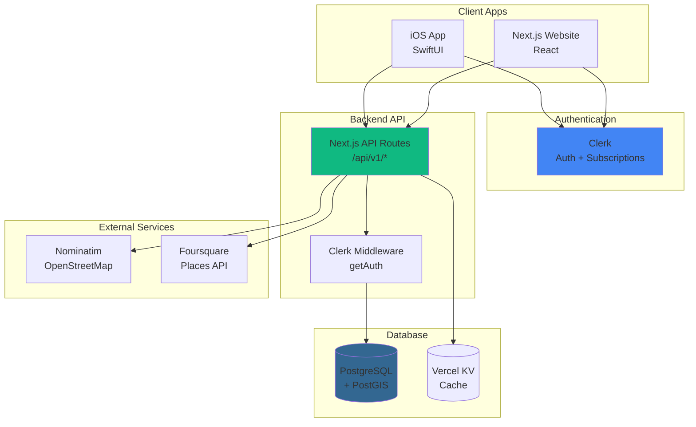

# Unified Backend & Clerk Integration Plan

**Date**: 2025-11-22
**Goal**: Ensure website and iOS app share the same backend, database, and authentication (Clerk)

---

## Current Architecture Issues

### 🔴 Problems Identified

1. **Dual Authentication Systems**:
   - Web uses **Clerk** (modern, subscription-ready)
   - Mobile was designed for **Sign in with Apple + custom JWT**
   - **Issue**: Users can't sign in across platforms, data not shared

2. **Fragmented Backend**:
   - **Old API** (`/api/v1/cards`, `/api/v1/auth/apple`) uses custom JWT
   - **New API** (`/api/v1/region-refresh`, `/api/v1/place`) uses Clerk middleware (potentially)
   - **Issue**: Mixed routing styles, unclear which endpoints require which auth

3. **Database Confusion**:
   - **In-memory DB** (`api/utils/db.js`) for dev
   - **File-based storage** (`data/curated-networks.json`) for locations
   - **Vercel KV** (Redis) for caching
   - **Issue**: No persistent database, data lost on restart

4. **iOS Missing Clerk Integration**:
   - iOS app has no Clerk SDK
   - No subscription management on mobile
   - No cross-platform user identity

---

## Unified Architecture (Target State)



### Key Changes

1. **Single Auth Provider**: Clerk for both web and iOS
2. **Unified API**: All endpoints use Clerk middleware for auth
3. **Persistent Database**: Migrate to PostgreSQL + PostGIS
4. **Shared User Identity**: Clerk user ID used across platforms

---

## Implementation Plan

### Phase 1: Database Migration (Week 1)

#### 1.1 Set Up Vercel Postgres

```bash
# Install Vercel Postgres
npm install @vercel/postgres

# Create database
vercel postgres create cardoncue-db
```

#### 1.2 Database Schema

**File**: `web/db/schema.sql`

```sql
-- Enable PostGIS extension for geospatial queries
CREATE EXTENSION IF NOT EXISTS postgis;

-- Users table (synced with Clerk)
CREATE TABLE users (
    id TEXT PRIMARY KEY,                    -- Clerk user ID (user_...)
    email TEXT,
    full_name TEXT,
    clerk_created_at TIMESTAMPTZ,
    created_at TIMESTAMPTZ NOT NULL DEFAULT NOW(),
    updated_at TIMESTAMPTZ NOT NULL DEFAULT NOW(),
    preferences JSONB DEFAULT '{
        "sync_enabled": false,
        "notification_radius_meters": 100
    }'::jsonb
);

-- Cards table
CREATE TABLE cards (
    id UUID PRIMARY KEY DEFAULT gen_random_uuid(),
    user_id TEXT NOT NULL REFERENCES users(id) ON DELETE CASCADE,
    name TEXT NOT NULL,
    barcode_type TEXT NOT NULL,
    payload_encrypted TEXT NOT NULL,        -- Base64: "nonce:ciphertext:tag"
    tags TEXT[],
    network_ids TEXT[],
    valid_from TIMESTAMPTZ,
    valid_to TIMESTAMPTZ,
    one_time BOOLEAN DEFAULT false,
    used_at TIMESTAMPTZ,
    metadata JSONB DEFAULT '{}'::jsonb,
    created_at TIMESTAMPTZ NOT NULL DEFAULT NOW(),
    updated_at TIMESTAMPTZ NOT NULL DEFAULT NOW(),
    archived_at TIMESTAMPTZ
);

CREATE INDEX idx_cards_user_id ON cards(user_id);
CREATE INDEX idx_cards_network_ids ON cards USING GIN(network_ids);

-- Networks table
CREATE TABLE networks (
    id TEXT PRIMARY KEY,
    name TEXT NOT NULL,
    canonical_names TEXT[],
    category TEXT NOT NULL,
    is_large_area BOOLEAN DEFAULT false,
    default_radius_meters INTEGER DEFAULT 100,
    tags TEXT[],
    created_at TIMESTAMPTZ NOT NULL DEFAULT NOW(),
    updated_at TIMESTAMPTZ NOT NULL DEFAULT NOW()
);

-- Locations table with PostGIS geometry
CREATE TABLE locations (
    id TEXT PRIMARY KEY,
    network_id TEXT NOT NULL REFERENCES networks(id) ON DELETE CASCADE,
    name TEXT NOT NULL,
    address TEXT,
    location GEOGRAPHY(POINT, 4326) NOT NULL,  -- PostGIS geometry
    radius_meters INTEGER DEFAULT 100,
    phone TEXT,
    hours JSONB,
    created_at TIMESTAMPTZ NOT NULL DEFAULT NOW(),
    updated_at TIMESTAMPTZ NOT NULL DEFAULT NOW()
);

CREATE INDEX idx_locations_network_id ON locations(network_id);
CREATE INDEX idx_locations_geography ON locations USING GIST(location);

-- Region cache (for iOS optimization)
CREATE TABLE region_cache (
    user_id TEXT NOT NULL REFERENCES users(id) ON DELETE CASCADE,
    regions JSONB NOT NULL,                    -- Array of monitored regions
    last_refresh_lat DOUBLE PRECISION,
    last_refresh_lon DOUBLE PRECISION,
    last_refresh_at TIMESTAMPTZ NOT NULL,
    cache_ttl_seconds INTEGER DEFAULT 21600,  -- 6 hours
    PRIMARY KEY (user_id)
);

-- Subscriptions (synced from Clerk)
CREATE TABLE subscriptions (
    id TEXT PRIMARY KEY,                       -- Clerk subscription ID
    user_id TEXT NOT NULL REFERENCES users(id) ON DELETE CASCADE,
    status TEXT NOT NULL,                      -- active, canceled, past_due
    plan_id TEXT NOT NULL,                     -- free, premium
    current_period_start TIMESTAMPTZ,
    current_period_end TIMESTAMPTZ,
    cancel_at_period_end BOOLEAN DEFAULT false,
    created_at TIMESTAMPTZ NOT NULL DEFAULT NOW(),
    updated_at TIMESTAMPTZ NOT NULL DEFAULT NOW()
);

CREATE INDEX idx_subscriptions_user_id ON subscriptions(user_id);

-- Row-level security policies
ALTER TABLE cards ENABLE ROW LEVEL SECURITY;
ALTER TABLE region_cache ENABLE ROW LEVEL SECURITY;

-- Function to get current user ID from Clerk
CREATE OR REPLACE FUNCTION current_user_id() RETURNS TEXT AS $$
    SELECT current_setting('app.current_user_id', true)::TEXT;
$$ LANGUAGE SQL STABLE;

-- Policy: Users can only access their own cards
CREATE POLICY cards_isolation ON cards
    FOR ALL
    TO PUBLIC
    USING (user_id = current_user_id());

-- Policy: Users can only access their own region cache
CREATE POLICY region_cache_isolation ON region_cache
    FOR ALL
    TO PUBLIC
    USING (user_id = current_user_id());
```

#### 1.3 Migration Script

**File**: `web/db/migrate.ts`

```typescript
import { sql } from '@vercel/postgres';
import fs from 'fs';
import path from 'path';

async function migrate() {
  const schemaSQL = fs.readFileSync(
    path.join(__dirname, 'schema.sql'),
    'utf-8'
  );

  console.log('Running database migration...');

  try {
    await sql.query(schemaSQL);
    console.log('✅ Migration successful');
  } catch (error) {
    console.error('❌ Migration failed:', error);
    throw error;
  }
}

migrate();
```

#### 1.4 Seed Curated Data

**File**: `web/db/seed.ts`

```typescript
import { sql } from '@vercel/postgres';
import curatedNetworks from '../data/curated-networks.json';

async function seed() {
  console.log('Seeding database with curated networks...');

  for (const network of curatedNetworks.networks) {
    // Insert network
    await sql`
      INSERT INTO networks (id, name, canonical_names, category, is_large_area, default_radius_meters, tags)
      VALUES (
        ${network.id},
        ${network.name},
        ${network.canonical_names},
        ${network.category},
        ${network.is_large_area},
        ${network.default_radius_meters},
        ${network.tags}
      )
      ON CONFLICT (id) DO UPDATE SET
        name = EXCLUDED.name,
        canonical_names = EXCLUDED.canonical_names,
        updated_at = NOW()
    `;

    // Insert locations for this network
    for (const location of network.locations || []) {
      await sql`
        INSERT INTO locations (id, network_id, name, address, location, radius_meters, phone)
        VALUES (
          ${location.id},
          ${network.id},
          ${location.name},
          ${location.address || null},
          ST_SetSRID(ST_MakePoint(${location.lon}, ${location.lat}), 4326)::geography,
          ${location.radius || network.default_radius_meters},
          ${location.phone || null}
        )
        ON CONFLICT (id) DO UPDATE SET
          name = EXCLUDED.name,
          address = EXCLUDED.address,
          location = EXCLUDED.location,
          updated_at = NOW()
      `;
    }

    console.log(`✅ Seeded ${network.id}: ${network.locations?.length || 0} locations`);
  }

  console.log('✅ Seed complete');
}

seed();
```

---

### Phase 2: Clerk Integration (Week 1-2)

#### 2.1 Backend API Updates

**File**: `web/app/api/utils/clerk-auth.ts`

```typescript
import { auth } from '@clerk/nextjs/server';
import { NextRequest, NextResponse } from 'next/server';
import { sql } from '@vercel/postgres';

/**
 * Middleware to require Clerk authentication
 */
export async function requireClerkAuth(
  handler: (req: NextRequest, userId: string) => Promise<NextResponse>
) {
  return async (req: NextRequest) => {
    const { userId } = auth();

    if (!userId) {
      return NextResponse.json(
        { error: 'unauthorized', message: 'Authentication required' },
        { status: 401 }
      );
    }

    // Set current user for RLS
    await sql`SET LOCAL app.current_user_id = ${userId}`;

    // Ensure user exists in our database
    await ensureUserExists(userId);

    return handler(req, userId);
  };
}

/**
 * Sync Clerk user to our database
 */
async function ensureUserExists(userId: string) {
  const { user } = await clerkClient.users.getUser(userId);

  await sql`
    INSERT INTO users (id, email, full_name, clerk_created_at)
    VALUES (
      ${userId},
      ${user.emailAddresses[0]?.emailAddress},
      ${user.firstName} ${user.lastName},
      ${new Date(user.createdAt)}
    )
    ON CONFLICT (id) DO UPDATE SET
      email = EXCLUDED.email,
      full_name = EXCLUDED.full_name,
      updated_at = NOW()
  `;
}

/**
 * Get current user from Clerk + database
 */
export async function getCurrentUser(userId: string) {
  const result = await sql`
    SELECT * FROM users WHERE id = ${userId}
  `;

  return result.rows[0];
}
```

#### 2.2 Update Existing API Routes

**Example**: `web/app/api/v1/cards/route.ts` (new file, replaces old version)

```typescript
import { NextRequest, NextResponse } from 'next/server';
import { requireClerkAuth, getCurrentUser } from '../../utils/clerk-auth';
import { sql } from '@vercel/postgres';

export const GET = requireClerkAuth(async (req: NextRequest, userId: string) => {
  const { searchParams } = new URL(req.url);
  const includeArchived = searchParams.get('include_archived') === 'true';
  const networkId = searchParams.get('network_id');

  let query = sql`
    SELECT * FROM cards
    WHERE user_id = ${userId}
  `;

  if (!includeArchived) {
    query = sql`${query} AND archived_at IS NULL`;
  }

  if (networkId) {
    query = sql`${query} AND ${networkId} = ANY(network_ids)`;
  }

  const result = await query;

  return NextResponse.json({
    cards: result.rows,
    count: result.rowCount,
  });
});

export const POST = requireClerkAuth(async (req: NextRequest, userId: string) => {
  const body = await req.json();
  const { name, barcode_type, payload_encrypted, tags, network_ids, valid_from, valid_to, one_time, metadata } = body;

  // Validate
  if (!name || !barcode_type || !payload_encrypted) {
    return NextResponse.json(
      { error: 'invalid_request', message: 'Missing required fields' },
      { status: 400 }
    );
  }

  // Insert card
  const result = await sql`
    INSERT INTO cards (user_id, name, barcode_type, payload_encrypted, tags, network_ids, valid_from, valid_to, one_time, metadata)
    VALUES (
      ${userId},
      ${name},
      ${barcode_type},
      ${payload_encrypted},
      ${tags || []},
      ${network_ids || []},
      ${valid_from || null},
      ${valid_to || null},
      ${one_time || false},
      ${JSON.stringify(metadata || {})}
    )
    RETURNING *
  `;

  return NextResponse.json(result.rows[0], { status: 201 });
});
```

#### 2.3 iOS Clerk Integration

**Add to iOS Project**:

1. **Install Clerk iOS SDK via Swift Package Manager**:
   - In Xcode: File → Add Package Dependencies
   - URL: `https://github.com/clerk/clerk-sdk-ios`
   - Version: Latest

2. **Create Clerk Configuration File**:

**File**: `ios/CardOnCue/Services/ClerkAuthService.swift`

```swift
import Foundation
import Clerk

/// Clerk authentication service for iOS
@MainActor
class ClerkAuthService: ObservableObject {
    @Published var isSignedIn = false
    @Published var userId: String?
    @Published var userEmail: String?
    @Published var sessionToken: String?

    static let shared = ClerkAuthService()

    private init() {
        // Configure Clerk
        Clerk.configure(publishableKey: Configuration.clerkPublishableKey)

        // Listen for auth state changes
        Task {
            await setupAuthListener()
        }
    }

    private func setupAuthListener() async {
        // Listen to Clerk session changes
        for await session in Clerk.shared.sessionStream {
            if let session = session {
                self.isSignedIn = true
                self.userId = session.userId
                self.sessionToken = session.lastActiveToken?.jwt

                // Get user email
                if let user = Clerk.shared.user {
                    self.userEmail = user.primaryEmailAddress?.emailAddress
                }
            } else {
                self.isSignedIn = false
                self.userId = nil
                self.userEmail = nil
                self.sessionToken = nil
            }
        }
    }

    /// Sign in with Apple via Clerk
    func signInWithApple() async throws {
        try await Clerk.shared.signIn.create(strategy: .apple)
    }

    /// Sign out
    func signOut() async throws {
        try await Clerk.shared.signOut()
    }

    /// Get current session token for API calls
    func getSessionToken() async throws -> String {
        guard let session = Clerk.shared.session else {
            throw AuthError.notSignedIn
        }

        // Get fresh token
        let token = try await session.getToken()
        return token.jwt
    }
}

enum AuthError: LocalizedError {
    case notSignedIn
    case tokenExpired

    var errorDescription: String? {
        switch self {
        case .notSignedIn:
            return "User is not signed in"
        case .tokenExpired:
            return "Session token expired"
        }
    }
}
```

3. **Update APIClient to use Clerk tokens**:

**File**: `ios/CardOnCue/Services/APIClient.swift` (update)

```swift
import Foundation

class APIClient {
    private let baseURL: URL
    private let clerkAuthService: ClerkAuthService
    private let session: URLSession

    init(baseURL: String, clerkAuthService: ClerkAuthService) {
        self.baseURL = URL(string: baseURL)!
        self.clerkAuthService = clerkAuthService
        self.session = URLSession.shared
    }

    // MARK: - Cards

    func getCards() async throws -> [Card] {
        let endpoint = "/v1/cards"
        let response: CardsResponse = try await get(endpoint)
        return response.cards
    }

    func createCard(_ card: CreateCardRequest) async throws -> Card {
        let endpoint = "/v1/cards"
        return try await post(endpoint, body: card)
    }

    // MARK: - Region Refresh

    func refreshRegions(_ request: RegionRefreshRequest) async throws -> RegionRefreshResponse {
        let endpoint = "/v1/region-refresh"
        return try await post(endpoint, body: request)
    }

    // MARK: - Generic HTTP Methods

    private func get<T: Decodable>(_ endpoint: String) async throws -> T {
        let url = baseURL.appendingPathComponent(endpoint)
        var request = URLRequest(url: url)
        request.httpMethod = "GET"

        try await addClerkAuthHeader(to: &request)

        return try await performRequest(request)
    }

    private func post<T: Decodable, U: Encodable>(_ endpoint: String, body: U) async throws -> T {
        let url = baseURL.appendingPathComponent(endpoint)
        var request = URLRequest(url: url)
        request.httpMethod = "POST"
        request.setValue("application/json", forHTTPHeaderField: "Content-Type")

        let encoder = JSONEncoder()
        encoder.keyEncodingStrategy = .convertToSnakeCase
        request.httpBody = try encoder.encode(body)

        try await addClerkAuthHeader(to: &request)

        return try await performRequest(request)
    }

    private func addClerkAuthHeader(to request: inout URLRequest) async throws {
        // Get fresh token from Clerk
        let token = try await clerkAuthService.getSessionToken()
        request.setValue("Bearer \(token)", forHTTPHeaderField: "Authorization")
    }

    private func performRequest<T: Decodable>(_ request: URLRequest) async throws -> T {
        // ... (rest of implementation unchanged)
    }
}

// Request/Response models
struct CreateCardRequest: Codable {
    let name: String
    let barcodeType: String
    let payloadEncrypted: String
    let tags: [String]?
    let networkIds: [String]?
    let validFrom: Date?
    let validTo: Date?
    let oneTime: Bool?
    let metadata: [String: String]?
}
```

4. **Update App Entry Point**:

**File**: `ios/CardOnCue/CardOnCueApp.swift`

```swift
import SwiftUI
import Clerk

@main
struct CardOnCueApp: App {
    @StateObject private var clerkAuth = ClerkAuthService.shared
    @StateObject private var locationService = LocationService()

    var body: some Scene {
        WindowGroup {
            if clerkAuth.isSignedIn {
                MainTabView()
                    .environmentObject(clerkAuth)
                    .environmentObject(locationService)
            } else {
                SignInView()
                    .environmentObject(clerkAuth)
            }
        }
    }
}
```

5. **Create Sign-In View**:

**File**: `ios/CardOnCue/Views/SignInView.swift`

```swift
import SwiftUI
import Clerk

struct SignInView: View {
    @EnvironmentObject var clerkAuth: ClerkAuthService
    @State private var isLoading = false
    @State private var errorMessage: String?

    var body: some View {
        VStack(spacing: 30) {
            // Logo
            Image(systemName: "creditcard.fill")
                .font(.system(size: 80))
                .foregroundColor(.blue)

            Text("CardOnCue")
                .font(.largeTitle)
                .fontWeight(.bold)

            Text("Your cards, right when you need them")
                .font(.subheadline)
                .foregroundColor(.secondary)
                .multilineTextAlignment(.center)

            Spacer()

            // Sign in with Apple button
            Button {
                Task {
                    isLoading = true
                    errorMessage = nil

                    do {
                        try await clerkAuth.signInWithApple()
                    } catch {
                        errorMessage = error.localizedDescription
                    }

                    isLoading = false
                }
            } label: {
                HStack {
                    Image(systemName: "applelogo")
                    Text("Sign in with Apple")
                }
                .frame(maxWidth: .infinity)
                .padding()
                .background(Color.black)
                .foregroundColor(.white)
                .cornerRadius(10)
            }
            .disabled(isLoading)

            if let errorMessage = errorMessage {
                Text(errorMessage)
                    .foregroundColor(.red)
                    .font(.caption)
            }

            Spacer()
        }
        .padding()
    }
}
```

---

### Phase 3: Subscription Management (Week 2)

#### 3.1 Clerk Webhooks for Subscription Sync

**File**: `web/app/api/webhooks/clerk/route.ts`

```typescript
import { Webhook } from 'svix';
import { headers } from 'next/headers';
import { sql } from '@vercel/postgres';

export async function POST(req: Request) {
  const WEBHOOK_SECRET = process.env.CLERK_WEBHOOK_SECRET;

  if (!WEBHOOK_SECRET) {
    throw new Error('Please add CLERK_WEBHOOK_SECRET to .env');
  }

  const headerPayload = headers();
  const svix_id = headerPayload.get('svix-id');
  const svix_timestamp = headerPayload.get('svix-timestamp');
  const svix_signature = headerPayload.get('svix-signature');

  if (!svix_id || !svix_timestamp || !svix_signature) {
    return new Response('Error: Missing svix headers', { status: 400 });
  }

  const payload = await req.json();
  const body = JSON.stringify(payload);

  const wh = new Webhook(WEBHOOK_SECRET);

  let evt;
  try {
    evt = wh.verify(body, {
      'svix-id': svix_id,
      'svix-timestamp': svix_timestamp,
      'svix-signature': svix_signature,
    });
  } catch (err) {
    console.error('Error verifying webhook:', err);
    return new Response('Error: Verification failed', { status: 400 });
  }

  const eventType = evt.type;

  // Handle events
  switch (eventType) {
    case 'user.created':
      await handleUserCreated(evt.data);
      break;
    case 'user.updated':
      await handleUserUpdated(evt.data);
      break;
    case 'user.deleted':
      await handleUserDeleted(evt.data);
      break;
    case 'subscription.created':
    case 'subscription.updated':
      await handleSubscriptionUpdated(evt.data);
      break;
    case 'subscription.deleted':
      await handleSubscriptionDeleted(evt.data);
      break;
  }

  return new Response('', { status: 200 });
}

async function handleUserCreated(data: any) {
  await sql`
    INSERT INTO users (id, email, full_name, clerk_created_at)
    VALUES (
      ${data.id},
      ${data.email_addresses[0]?.email_address},
      ${data.first_name} ${data.last_name},
      ${new Date(data.created_at)}
    )
    ON CONFLICT (id) DO NOTHING
  `;
}

async function handleUserUpdated(data: any) {
  await sql`
    UPDATE users SET
      email = ${data.email_addresses[0]?.email_address},
      full_name = ${data.first_name} ${data.last_name},
      updated_at = NOW()
    WHERE id = ${data.id}
  `;
}

async function handleUserDeleted(data: any) {
  await sql`DELETE FROM users WHERE id = ${data.id}`;
}

async function handleSubscriptionUpdated(data: any) {
  await sql`
    INSERT INTO subscriptions (id, user_id, status, plan_id, current_period_start, current_period_end, cancel_at_period_end)
    VALUES (
      ${data.id},
      ${data.user_id},
      ${data.status},
      ${data.plan_id},
      ${new Date(data.current_period_start)},
      ${new Date(data.current_period_end)},
      ${data.cancel_at_period_end}
    )
    ON CONFLICT (id) DO UPDATE SET
      status = EXCLUDED.status,
      plan_id = EXCLUDED.plan_id,
      current_period_start = EXCLUDED.current_period_start,
      current_period_end = EXCLUDED.current_period_end,
      cancel_at_period_end = EXCLUDED.cancel_at_period_end,
      updated_at = NOW()
  `;
}

async function handleSubscriptionDeleted(data: any) {
  await sql`DELETE FROM subscriptions WHERE id = ${data.id}`;
}
```

#### 3.2 iOS Subscription Check

**File**: `ios/CardOnCue/Services/SubscriptionService.swift`

```swift
import Foundation

struct Subscription: Codable {
    let id: String
    let userId: String
    let status: String
    let planId: String
    let currentPeriodEnd: Date
    let cancelAtPeriodEnd: Bool
}

class SubscriptionService {
    private let apiClient: APIClient

    init(apiClient: APIClient) {
        self.apiClient = apiClient
    }

    func getCurrentSubscription() async throws -> Subscription? {
        // API endpoint to get user's subscription
        let endpoint = "/v1/user/subscription"
        return try await apiClient.get(endpoint)
    }

    func isPremium() async -> Bool {
        guard let subscription = try? await getCurrentSubscription() else {
            return false
        }

        return subscription.status == "active" && subscription.planId == "premium"
    }
}
```

---

### Phase 4: Testing & Deployment (Week 3)

#### 4.1 Integration Tests

**File**: `web/__tests__/integration/clerk-auth.test.ts`

```typescript
import { createClerkClient } from '@clerk/backend';

describe('Clerk Integration', () => {
  test('Creates user in database on first sign-in', async () => {
    // Test webhook handler
  });

  test('API endpoints require valid Clerk token', async () => {
    // Test authentication
  });

  test('iOS can authenticate with Clerk and call API', async () => {
    // Test mobile flow
  });
});
```

#### 4.2 Deployment Checklist

- [ ] Set up Vercel Postgres database
- [ ] Run migrations (`npm run db:migrate`)
- [ ] Seed curated data (`npm run db:seed`)
- [ ] Set environment variables:
  - `NEXT_PUBLIC_CLERK_PUBLISHABLE_KEY`
  - `CLERK_SECRET_KEY`
  - `CLERK_WEBHOOK_SECRET`
  - `POSTGRES_URL`
  - `POSTGRES_PRISMA_URL`
  - `POSTGRES_URL_NON_POOLING`
- [ ] Configure Clerk webhooks (point to `/api/webhooks/clerk`)
- [ ] Test web sign-in flow
- [ ] Test iOS sign-in flow
- [ ] Deploy to Vercel
- [ ] Submit iOS app update to TestFlight

---

## Migration Path

### For Existing Users (if any)

1. **Web users**: Already on Clerk, no migration needed
2. **iOS users** (Sign in with Apple):
   - On next app update, prompt to "Continue with existing account"
   - Match Apple ID email to Clerk user
   - Link accounts via Clerk's external account linking

---

## Cost Estimate

| Service | Free Tier | Estimated Cost (1K users) |
|---------|-----------|---------------------------|
| Clerk | 10K MAU | $0 (under limit) |
| Vercel Postgres | 60 hours compute | $0 (under limit) |
| Vercel KV | 30K commands/day | $0 (under limit) |
| Nominatim | Rate limited | $0 (self-hosted or public) |
| Foursquare | 50K calls/month | $0 (optional, under limit) |
| **Total** | | **$0/month** |

Scales to ~10K users before needing paid tiers.

---

## Next Steps

1. Review this plan
2. Approve database schema
3. Begin Phase 1 (database migration)
4. Test Clerk integration on web
5. Integrate Clerk iOS SDK
6. Deploy and test end-to-end

**Questions?** Review specific sections and provide feedback.
